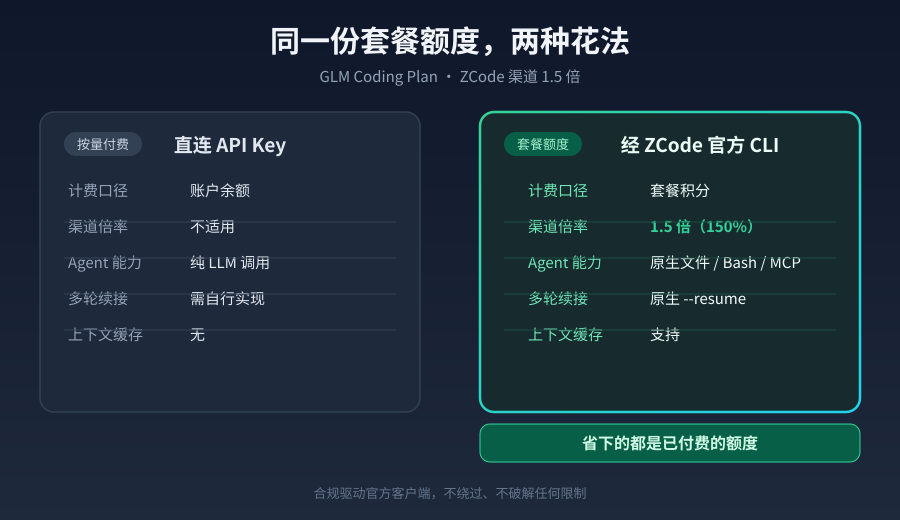

# dsh-zcode-coding-plan

**中文** · [English](README.en.md) · [Release notes](https://github.com/yuyang2230/dsh-zcode-coding-plan/releases)

[](https://github.com/yuyang2230/dsh-zcode-coding-plan/actions/workflows/ci.yml)
[](LICENSE)
[](https://nodejs.org)
[](https://zcode.z.ai/cn/docs)

**买了 GLM Coding Plan，却只在别的客户端里用？** 这个 DSH 桌面端插件让那份已付费的套餐额度，
在 DeepSeek Harness 会话里真正发挥作用——把编码重活派给官方 ZCode 通道，享受 **1.5 倍（150%）**额度，
外加原生 Agent 能力（文件 / Bash / MCP）与多轮会话。



> 合规驱动官方 ZCode 客户端，**不修改客户端、不伪造请求、不绕过任何限制**。

**注册两个工具：**

| 工具 | 作用 |
| --- | --- |
| `zcode_call` | 派一个真实 agent 任务给套餐通道，支持 `--resume` 多轮续接 |
| `zcode_quota` | 查套餐余量；配合内置闸门做到「余量够才自动派活」 |

**先看对比，再决定要不要装** ↓

---

## 为什么用它：直连 API Key vs 本插件

同一个 GLM Coding Plan 套餐 Key，两种花法，结果差很远。

| 维度 | 直连 API Key（自己调 `open.bigmodel.cn/api/anthropic`） | 本插件（经 ZCode 官方 CLI） |
| --- | --- | --- |
| **计费口径** | 扣**账户余额**（按量付费，与套餐无关） | 扣**套餐积分**（你已付费的订阅额度） |
| **ZCode 渠道倍率** | 不适用——非官方指定工具，无倍率概念 | **1.5 倍（150%）**套餐额度消耗 |
| **前置条件** | 任意智谱 API Key 即可 | 需装 **ZCode 客户端** + 有 **GLM Coding Plan 订阅** |
| **Agent 能力** | 纯 LLM 调用，只有模型本身的读写/执行能力 | 原生**文件 / Bash / MCP / Hooks**，是完整 agent |
| **多轮续接** | 自己实现会话状态，自己管重试与上下文裁剪 | 原生 `--resume <sessionId>`，客户端负责 |
| **上下文缓存** | 无 | **支持**（实测 cacheReadTokens 命中约 13K–68K） |
| **凭证管理** | 你自己在代码里塞 Key | Key 交给官方客户端，本插件只做路由 |
| **可审计性** | 无内建记录 | ZCode 本地 `db.sqlite` 逐条记录 provider/model/token |
| **故障面** | 自己维护 | 依赖 ZCode 客户端版本（升级可能改 schema） |

更详细的计费与能力矩阵见 **[docs/comparison.md](docs/comparison.md)**。

### 什么时候值得

- 你**已经买了** GLM Coding Plan，但 DSH 这边没在用 → 套餐在闲置，本插件让它干活；
- 你想把**多文件重构 / 跑测试 / 批量修改**这类重活外包出去，不想让它们吃主会话额度；
- 你看重**可审计**（每次调用 provider、model、token 都有本地记录）。

### 什么时候不值得

- **你没有 Coding Plan 订阅** → 装了无效果，白折腾。直连 API Key 按量扣余额也完全能用。
- 你只想要**一次性的短问答** → 起 ZCode 子进程要背约 66K tokens 的系统提示，比裸 API 调用重得多。
- 你**不接受**在机器上多装一个 Electron 客户端 → 本插件依赖它。

### 快速判断：装之前问自己三句

1. 我**已经订阅**了 GLM Coding Plan 吗？（没有 → 跳过本插件）
2. 我平时主要在 **DSH** 里干活，而不是 ZCode 客户端里？（是 → 插件有用）
3. 我有重活（多文件重构 / 跑测试 / 批量修改）想外包吗？（有 → 直接收益）

三个都是「是」再往下看安装。

---

## 安装（3 步）

### 0. 前置：装 ZCode，并准备好套餐 Key

1. 安装 **ZCode 官方客户端**：<https://zcode.z.ai/cn/docs/install>
2. 在智谱平台开通 **GLM Coding Plan**，拿到套餐 API Key。
3. 把 Key 放进 DSH 凭据文件 `~/.dsh/.credentials.yaml` 的 `refs:` 段（**插件不附带任何 Key**，也没有 Key 就无法工作）：

   ```yaml
   refs:
     BIGMODEL_CODING_PLAN_API_KEY: 你的套餐Key
   ```

### 1. 放插件并注册

把仓库放到你机器上的任意目录，例如 `C:/tools/dsh-zcode-coding-plan`。

**A) 注册到 DSH profile** —— 编辑 `~/.dsh/profiles/desktop/cordis.patch.yml`，在顶层列表追加：

```yaml
    - id: zcode-coding-plan
      name: dsh-zcode-coding-plan
      config:
        # 下面三行可以整个省略 —— 插件会自动探测 ZCode 安装位置
        # zcodeExe: 'D:/Program Files/ZCode/ZCode.exe'
        # zcodeCjs: 'D:/Program Files/ZCode/resources/glm/zcode.cjs'
        # builtinProviderConfig: 'D:/Program Files/ZCode/resources/config/provider/zcode-builtin.json'
        providerOverride: 'C:/Users/你的用户名/.dsh/zcode-provider-override.json'
        defaultMode: yolo
        defaultTimeoutMs: 900000
        # 余量闸门可选：填脚本路径才有闸门；留空则直接派活（fail-open）
        quotaScript: ''
```

> 编辑前先备份（`cordis.patch.yml.bak-<用途>-<时间戳>`）——运行中的 DSH 可能改写它。

**B) 加依赖** —— 在 DSH 应用目录的 `package.json` 的 `dependencies` 里追加：

```json
    "dsh-zcode-coding-plan": "link:C:/tools/dsh-zcode-coding-plan"
```

**C) 建 junction** —— 在 DSH 应用目录执行：

```bash
node -e "require('fs').symlinkSync('C:/tools/dsh-zcode-coding-plan', require('path').join(process.cwd(),'node_modules','dsh-zcode-coding-plan'), 'junction')"
```

> 用 `link:` + junction，不要用 `cp` 复制——复制后插件改动不会生效。

### 2. 生成 provider 覆盖配置 + 自检

```bash
cd C:/tools/dsh-zcode-coding-plan
node scripts/generate-override.mjs   # 读 ~/.dsh/.credentials.yaml，写 ~/.dsh/zcode-provider-override.json
node scripts/setup-check.mjs          # 环境自检，退出码 0 = 就绪
```

或者用 `node scripts/install.mjs` 一步打印上面所有片段（含本机探测到的真实路径）。

最后**重启 DSH 桌面端**。日志里应出现：

```
[dsh-zcode-coding-plan] tools zcode_call + zcode_quota registered; zcode=… cjs=… override=… probe=windows-paths
```

---

## 用法

### 自然语言触发

跟 agent 这么说就会走本插件：

- 「用 zcode 跑这个重构」「把编码任务派给 ZCode」
- 「省 DSH 额度」「吃 150% 配额」
- 「让 GLM Coding Plan 干这个重活」

agent 会先 `zcode_quota` 查余量，再决定是否 `zcode_call` 派活。

### `zcode_call` 参数

| 参数 | 类型 | 必填 | 说明 |
| --- | --- | --- | --- |
| `prompt` | string | ✅ | 派给 GLM 的任务提示词，写清目标与验收标准 |
| `cwd` | string | | 任务工作目录；绝对路径或相对会话目录；省略 = 会话工作目录 |
| `resume` | string | | 上次返回的 `sessionId`，续接多轮会话 |
| `mode` | string | | `build`/`edit`/`plan`/`yolo`，默认 `yolo`（全自动）；仅咨询用 `plan` |
| `timeout_ms` | number | | 子进程超时，默认 900000（15 分钟），钳制到 [30000, 3600000] |
| `force` | boolean | | `true` 跳过余量闸门强行执行（默认 false，余量不足返回 `quota_insufficient`） |

**返回**

```json
{
  "sessionId": "sess_…",
  "traceId": "…",
  "response": "…",
  "usage": { "inputTokens": 67512, "outputTokens": 4, "totalTokens": 67516 },
  "projection": { "contextWindow": 200000, "contextUsed": 67516 },
  "exitCode": 0
}
```

失败时返回 `{ error, hint?, timedOut?, timeoutMs?, exitCode?, stderrTail? }`。

### `zcode_quota` 参数

无参数。返回套餐余量与路由判定：

```json
{
  "available": true,
  "sufficient": true,
  "plan": "pro",
  "windowPct": 4.3, "routeWindowPct": 60,
  "weekPct": 16.0,  "routeWeekPct": 80
}
```

`available:false` 表示没配置余量脚本（正常状态，闸门会 fail-open 直接放行）。

### 多轮示例

```
1. zcode_call({ "prompt": "在 src/ 下新增一个 Express 服务并写好 README", "cwd": "D:/work/myproj" })
   → response: …, sessionId: "sess_124bfb13-fc98-42c4-8056-f0b3aa584bed"

2. zcode_call({ "prompt": "接着把测试补齐，跑到全绿", "cwd": "D:/work/myproj",
                "resume": "sess_124bfb13-fc98-42c4-8056-f0b3aa584bed" })

3. zcode_call({ "prompt": "评估要不要上 gRPC", "cwd": "D:/work/myproj",
                "resume": "sess_124bfb13-…", "mode": "plan" })   // 只讨论，不动文件
```

---

## 余量闸门（可选）

闸门在派活前跑一次本地余量估算脚本，**5h 窗口 < 60% 且本周 < 80% 才放行**，否则快速返回 `quota_insufficient`（不消耗任何额度、不启动子进程）。

**默认不启用**——发布版不预设任何人的监控脚本路径。配置 `quotaScript` 才生效；缺失/异常/超时一律 fail-open 放行。

脚本契约（任何满足此约定的程序都可以）：

```
<python> <quotaScript> --json --plan <plan>
→ stdout: {"plan":"pro","window_weighted":5,"window_cap":400,
           "week_weighted":308,"weekly_cap":2000}
```

结果缓存 60 秒，避免一个会话里反复起 python。强制执行用 `force: true`。

---

## 验证调用真的走了套餐

ZCode 把每次调用记在本地 `~/.zcode/cli/db/db.sqlite`（约 440MB，务必**只读**打开）：

```bash
python -c "
import sqlite3
con = sqlite3.connect('file:' + r'C:\Users\你的用户名\.zcode\cli\db\db.sqlite?mode=ro', uri=True)
for r in con.execute('select session_id, provider_id, model_id, status, input_tokens from model_usage order by rowid desc limit 3'):
    print(r)
"
```

期望 `provider_id == 'dsh-glm-coding-plan'`、`model_id == 'GLM-5.3-Flash'`。
如果是别的 provider id，说明覆盖配置没生效（多见于 `providerOrder[0]` 不是我们）。

本仓库的真实调用记录：

```
('sess_124bfb13-fc98-42c4-8056-f0b3aa584bed', 'dsh-glm-coding-plan', 'GLM-5.3-Flash', 'completed', 67512)
```

---

## 插件配置一览

`cordis.patch.yml` 的 `config:` 段，全部可选：

| 键 | 默认 | 说明 |
| --- | --- | --- |
| `zcodeRoot` | 探测 | ZCode 安装根目录 |
| `zcodeExe` / `zcodeCjs` / `builtinProviderConfig` | 探测 | 显式指定可跳过探测 |
| `providerOverride` | `~/.dsh/zcode-provider-override.json` | 覆盖配置路径（可用 `DSH_ZCODE_OVERRIDE` 覆盖） |
| `providerId` | `dsh-glm-coding-plan` | 注入的 provider id |
| `baseUrl` | `https://open.bigmodel.cn/api/anthropic` | 端点 |
| `modelIds` | `["GLM-5.3-Flash","GLM-5.3"]` | 套餐内可用模型 |
| `contextWindow` | `200000` | 写入覆盖配置的上下文窗口 |
| `defaultMode` / `defaultTimeoutMs` / `minTimeoutMs` / `maxTimeoutMs` | `yolo` / `900000` / `30000` / `3600000` | 调用参数 |
| `maxStdoutBytes` / `maxStderrBytes` | 16MB / 16KB | 输出上限 |
| `pythonExe` / `quotaScript` / `quotaPlan` | `python` / ``（空） / `pro` | 余量闸门 |
| `quotaRouteWindowPct` / `quotaRouteWeekPct` / `quotaCacheTtlMs` | `60` / `80` / `60000` | 余量闸门阈值与缓存 |

路径解析优先级：**插件 config > `ZCODE_HOME` 环境变量 > 平台探测**。

---

## 合规声明

本插件**驱动官方 ZCode 客户端**，用它已有的 provider 机制把套餐 Key 排在首位，从而让 DSH 的请求走官方的 Coding Plan 渠道。

- **不修改** ZCode 客户端任何代码或二进制；
- **不修改** ZCode 桌面端 provider 注册表（`…/provider_config.json`）；
- **不修改** `~/.zcode/v2/credentials.json`；
- **不伪造**请求、不绕过服务端校验、不破解任何限制；覆盖配置仅通过每次 spawn 的环境变量注入，不落盘到 ZCode 的目录；
- 使用请遵循智谱《[GLM Coding Plan 使用须知](https://bigmodel.cn/coding-plan)》及 ZCode 官方文档。

官方文档：<https://zcode.z.ai/cn/docs>

---

## 已知限制

1. **ZCode 升级可能改 provider schema**。本插件只生成实测验证过的 personal 键；ZCode 升级后 `lib/schema.js` 会读取其内置 provider 配置，**自动检测 personal schema 是否仍兼容**，并在生成日志 / `node scripts/setup-check.mjs` 输出告警——但**不会自动适配未知键**（那需要重新实测）。看到告警或 `Model creation failed` 时，按 `docs/troubleshooting.md` 第 2 节处理。
2. **每次新会话约 49K–66K tokens 系统提示**（实测单轮 inputTokens 约 67.5K）。这是官方客户端的固定成本，短问答很不划算。
3. **计费按请求次数**，不是按你的提示长度。单轮多步工具调用可能产生多条 model 记录。
4. **macOS / Linux 路径探测为尽力而为，未在本机验证**。本仓库的实测验证全部在 **Windows + ZCode 3.14.5** 上完成。其他平台可能需要显式配置 `zcodeExe`/`zcodeCjs`。
5. **并发保守**：`zcode_call` 标记为非并发安全，多派活会串行排队——这是刻意为之，避免双倍计费和机器被压垮。
6. **余量闸门依赖外部脚本**，本仓库不提供任何配额估算实现（无法通用估算各套餐的真实消耗）。

---

## 文档

- [docs/comparison.md](docs/comparison.md) — 详版对比：计费、倍率、能力矩阵、适用人群
- [docs/how-it-works.md](docs/how-it-works.md) — 机制原理：provider 注入、选模型规则、多轮、缓存
- [docs/troubleshooting.md](docs/troubleshooting.md) — 排障：找不到 ZCode / Model creation failed / 401 / 余量闸门 / 没额度

## 开发与贡献

- [CONTRIBUTING.md](CONTRIBUTING.md) — 开发约定、提交前检查、**provider 配置的两个硬性要求**
- [CHANGELOG.md](CHANGELOG.md) — 变更记录

```bash
npm test                                # 三套测试，114 断言，零计费（推荐）
npm run check                           # 环境自检（需要装了 ZCode）
npm run test:smoke -- "回复两个字：就绪"   # 真实调用（消耗套餐额度！）
```

仓库包含一份 CI 配置（Ubuntu + Windows × Node 18/20/22）。**测试全部使用 mock spawn，
在 CI 上不会调用 ZCode、不消耗任何额度**；真实调用只存在于 `npm run test:smoke`，刻意不进 CI。

## License

MIT — 见 [LICENSE](LICENSE)。